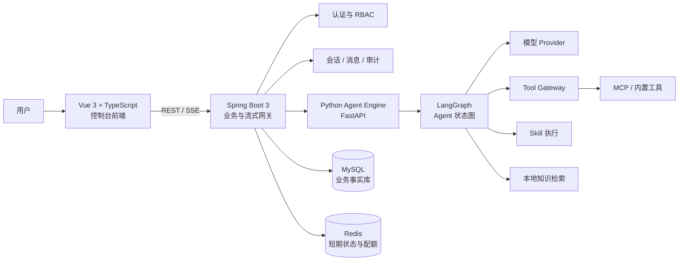

<div align="center">

# AgentForge

### 面向 AI Agent 构建、编排与治理的一体化智能体平台

<p>
  
  
  
  
</p>

<p>
  <a href="#-作品预览">作品预览</a> ·
  <a href="#-核心能力">核心能力</a> ·
  <a href="#-系统架构">系统架构</a> ·
  <a href="#-本地运行">本地运行</a> ·
  <a href="#-当前实现边界">实现边界</a>
</p>

> 这是我独立持续迭代的 AI Agent 平台作品。它不是一个只展示聊天框的 Demo，而是尝试把 **智能体运行、模型选择、工具与 MCP、Skill 技能包、知识库、审计与安全治理** 放进同一条可观察、可扩展的工程链路中。

</div>

---

## ✦ 作品定位

**AgentForge** 是一个前后端分离的企业级 AI Agent 平台原型，服务于“创建一个 Agent → 配置模型与能力 → 流式对话执行 → 查看调用过程与审计记录”的完整使用闭环。

项目更关注真实工程问题：多模型失败如何降级、工具调用如何管控、技能包如何安全导入、长链路如何追踪、聊天过程如何可视化但不泄露内部协议，以及数据与资源如何为后续多租户治理做好结构准备。

| 设计目标 | 在项目中的落地方式 |
| --- | --- |
| **不是黑盒聊天** | SSE 实时展示文本、工具、Skill、知识检索和完成状态等阶段事件。 |
| **不是静态配置页** | Agent、模型、工具、技能和知识库以资源绑定方式进入运行时。 |
| **不是只考虑“能跑”** | JWT、Refresh Token 轮换、Redis 限流、审计、配额预检与失败降级均纳入主链路。 |
| **不是堆技术名词** | Vue → Java → Python Agent Engine 的职责边界明确，调用过程可追踪。 |

---

## 🖼️ 作品预览

> 以深色、克制、信息密度高的控制台风格呈现。页面强调小巧的卡片、清晰的状态层级和过程可视化，而不是传统后台模板的堆砌。

<p align="center">
  
</p>

<p align="center"><sub>工具与技能页面：统一管理 Agent 可调用的工具、技能包与运行权限。</sub></p>

### 页面与模块

| 页面 / 模块 | 能力说明 |
| --- | --- |
| 💬 **会话工作台** | 流式对话、会话管理、Agent 选择、过程事件展示与错误提示。 |
| 🧠 **智能体管理** | 创建、编辑、发布、启停、删除 Agent；绑定系统提示词、模型、工具、Skill 与知识资源。 |
| 📚 **知识库** | 文档导入、分块、检索增强的基础链路；为 Agent 配置知识范围。 |
| 🧰 **工具与技能** | 内置工具、MCP 工具与 Skill 的统一管理；支持 ZIP / SkillZIP 技能包导入。 |
| 🤖 **模型管理** | 管理确定性模型及 OpenAI Compatible、DeepSeek、Qwen、Ollama 等模型配置。 |
| 👁 **可观测与审计** | 记录模型使用、工具 / Skill 调用、异常降级、操作审计与配额相关信息。 |

---

## ⚡ 核心能力

### 1. 流式 Agent 对话链路

```text
Vue 3 会话工作台
        │ SSE
        ▼
Spring Boot 业务后端
        │ NDJSON / HTTP
        ▼
Python Agent Engine
        │
        ├── LangGraph Agent 编排
        ├── Skill 优先路由
        ├── Tool Gateway 工具网关
        ├── RAG 检索工具
        └── LLM / 确定性模型
```

- 前端通过 **SSE** 接收增量内容、工具调用、技能执行、检索、错误及完成等事件。
- Java 后端负责鉴权、会话与消息持久化、节流写库、审计、用量记录和流式桥接。
- Python 引擎使用 **LangGraph + LangChain Core** 驱动 Agent 状态图。
- 过程信息按“分析摘要 / 行动 / 工具 / 技能 / 知识库 / 生成 / 完成”展示，不向用户泄露原始协议 JSON、敏感参数或内部思维链。

### 2. 可配置的 Agent 与多模型选择

- Agent 可配置系统提示词、模型、工具、技能、知识文档范围。
- 支持请求级模型、Agent 绑定模型、平台默认模型的优先级选择。
- 已覆盖确定性模型、本地 Ollama 和 OpenAI Compatible 类接口的接入模型。
- 真实模型不可达、上游超时、鉴权失败等场景会进行分类报错或安全降级，避免静默失败。

### 3. MCP、工具网关与执行安全

`ToolGateway` 是工具执行的统一入口，统一承担：

- 工具发现与租户可见性判断；
- 输入 / 输出 Schema 校验；
- 内置工具与 MCP 工具分发；
- 超时控制、结果归一化与调用审计；
- 对 Python 代码执行场景进行 AST 预检、危险导入 / 函数限制、独立工作目录、资源限制与输出截断。

### 4. Skill 技能包导入

Skill 以 `SKILL.md` + YAML frontmatter 为能力描述入口，兼容提示词正文及工具权限声明。

技能包导入已包含以下防护：

- ZIP 魔数、扩展名、文件大小与压缩条目数检查；
- 压缩包路径穿越、绝对路径与危险后缀拦截；
- 唯一 `SKILL.md` 校验、YAML 元信息校验；
- 租户目录隔离、原子移动、数据库事务与失败回滚；
- 支持 `.zip` 与 `.skillzip`，缺失版本时默认回填为 `1.0.0`。

### 5. 认证、权限与可观测性

- 用户名 / 邮箱 / 手机号统一登录入口；
- BCrypt 密码校验、JWT Access Token + Refresh Token 轮换；
- Redis 图形验证码、登录频控、Refresh Token 白名单与权限缓存；
- RBAC：用户 → 角色 → 权限；
- MySQL 记录审计、消息、工具 / Skill 调用过程和 API 用量；
- Trace ID 在前端请求、Java 服务与 Python 日志链路中贯通。

---

## 🧩 系统架构



### Agent 编排流

```text
START
  ↓
Agent 节点：读取上下文、模型与资源配置
  ↓
是否命中 Skill？ ── 是 → Skill Start → Skill Execute ─┐
  │                                                     │
  否                                                    ├→ 回到 Agent
  ↓                                                     │
是否需要工具？ ── 是 → Tool Start → Tool Gateway ──────┘
  │
  否
  ↓
生成回复 → END
```

---

## 🧱 技术栈

| 层级 | 技术选型 | 主要职责 |
| --- | --- | --- |
| 前端 | Vue 3 · TypeScript · Vite · Pinia · Vue Router · Axios | 控制台 UI、会话流式渲染、状态管理、路由与统一请求层。 |
| Java 后端 | Spring Boot 3 · Maven · JPA / MySQL | 认证授权、会话消息、资源管理、SSE 桥接、审计与用量。 |
| Agent 引擎 | Python · FastAPI · LangGraph · LangChain Core | Agent 状态图、模型调用、Skill / Tool 路由和检索编排。 |
| 数据与缓存 | MySQL · Redis | 业务事实库、会话与审计数据、验证码、限流、令牌白名单与实时配额。 |
| 扩展协议 | MCP · SSE · NDJSON | 外部工具接入、浏览器端流式推送、Java 到 Agent Engine 的事件传递。 |
| 目标检索架构 | PostgreSQL + pgvector（设计中） | 面向生产场景的向量分块、索引与多租户检索能力。 |

---

## 📁 项目结构

```text
.
├── frontend/                   # Vue 3 控制台前端
│   ├── src/                    # 页面、组件、状态、API 与路由
│   └── package.json
├── backend/                    # Spring Boot 多模块后端
│   ├── af-auth-api/            # 认证 DTO / API 契约
│   ├── af-auth-impl/           # 认证、JWT、RBAC、风控实现
│   ├── af-agent/               # Agent 资源与聊天相关模块
│   ├── af-session-api/         # 会话 API
│   ├── af-session-impl/        # 会话、消息与流式处理
│   ├── af-common/              # 通用配置、异常、审计与上下文
│   ├── af-bootstrap/           # Spring Boot 启动模块
│   ├── skill-repo/             # Skill 包存储目录
│   └── sql/                    # MySQL / pgvector DDL
├── agent-engine/               # Python Agent Engine
│   ├── app/graph/              # LangGraph 编排
│   ├── app/tools/              # 工具网关与工具实现
│   ├── app/skills/             # Skill 运行逻辑
│   ├── app/rag/                # 本地检索基础实现
│   └── data/knowledge/         # 本地知识索引数据
├── scripts/start-all.sh        # 五端本地一键启动脚本
├── docs/                       # 进度与工程文档
└── output/                     # 技术总书及相关产物
```

---

## 🚀 本地运行

### 环境准备

- macOS / Linux Shell 环境
- Java 17+（建议与 Spring Boot 3 匹配）
- Python 3.13+ 及 Agent Engine 所需虚拟环境
- Node.js 22+
- 本地 MySQL 与 Redis（项目启动脚本可使用仓库内本地开发实例）

### 一键启动

```bash
bash scripts/start-all.sh
```

脚本会依次检查或启动 MySQL、Redis、Python Agent Engine、Java 后端和 Vite 前端，并把运行日志写入 `logs/`。

### 本地服务地址

| 服务 | 地址 / 端口 |
| --- | --- |
| 前端控制台 | `http://127.0.0.1:5175/` |
| Java 后端健康检查 | `http://127.0.0.1:8090/health` |
| Python Agent Engine 健康检查 | `http://127.0.0.1:8000/health` |
| MySQL | `127.0.0.1:3308` |
| Redis | `127.0.0.1:6379` |

### 单独构建

```bash
# 前端
cd frontend
npm run build

# Java 后端
cd backend
mvn clean package
```

---

## 📖 工程文档

仓库中保留了一份持续维护的技术总书，覆盖认证、数据层、前端、SSE、LangGraph、MCP、Skill、RAG、模型、审计、测试与部署等主题：

- [AgentForge 从零开发全过程 · 全量源码逐行讲解（DOCX）](./output/agentforge-complete-source-guide/stage3/AgentForge-从零开发全过程-全量源码逐行讲解.docx)
- [技术总书 Markdown 真源](./output/agentforge-complete-source-guide/stage1/final_draft.md)
- [项目进度与真实状态](./docs/PROGRESS.md)

---

## ⚠️ 当前实现边界

这个仓库记录的是一个正在持续完善的真实作品，因此以下状态明确说明，不将“设计目标”包装成“已完全上线”：

| 能力 | 当前状态 | 说明 |
| --- | --- | --- |
| 基础对话、Agent 编排、工具 / Skill 链路 | ✅ 已具备基础闭环 | 已有本地启动、事件流与基础回归验证。 |
| Skill ZIP 导入 | ✅ 已完成关键修复 | 已验证 `.zip` / `.skillzip` 兼容和安全校验链路。 |
| RAG 稳定命中与来源引用 | 🚧 持续优化 | 已有本地分块 / 检索基础；Agent 文档绑定、租户隔离、删除传播、引用展示仍需继续强化。 |
| 外部知识源 | 🧭 规划中 | Notion、网页、数据库、企业文档库等的授权与增量同步尚未完整落地。 |
| 跨会话长期记忆 | 🧭 规划中 | 当前图 checkpoint 不等同于用户长期记忆；后续需要授权、过滤、管理与审计闭环。 |
| pgvector 生产向量检索 | 🧭 已有 DDL 设计 | 目前运行链路仍以本地索引降级实现为主。 |
| 阿里云生产部署 | 🚧 待实施 | 需完成资源评估、域名 / HTTPS、密钥管理、备份与回滚，且避免影响已有业务服务。 |

---

## 🗺️ 后续方向

- [ ] 完成 RAG 文档绑定、租户隔离、索引状态与可引用回答闭环；
- [ ] 接入外部知识源及 OAuth / 凭据加密 / 增量同步；
- [ ] 建立用户授权的跨会话长期记忆管理；
- [ ] 收紧认证前后端接口契约与 401 并发刷新失败处理；
- [ ] 完成容器化、HTTPS、监控告警与云端发布；
- [ ] 持续打磨 Agent、Skill、模型和审计页面的交互细节。

---

<div align="center">

### Built by Jack Yang

**AgentForge 是我的 AI Agent 平台作品集项目，会持续迭代。**

<sub>如果这个项目对你有启发，欢迎 Star 或通过 Issue 交流。</sub>

</div>
